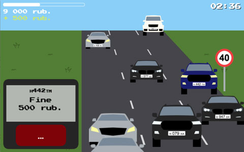

# Road Guard game

Write out speeding fines and reach the needed sum
before your shift ends.
 
[**Play the game**](https://alvov.github.io/road-guard-game/)

## How to play

1. Tap or click on a car on the road. Your radar
will start to compute the car's speed.  

2. After that the radar screen will show the car's
plate number and speed. If the speed is higher
than the speed limit + 20 km/h, the screen will
turn red.  

3. Then you might press the red `Fine!` button,
which will become active, to write out the fine.  
When on desktop you can also use the `spacebar` key
on your keyboard.  

4. **Pay attention to the plate numbers!** Some of the
cars belong to the authorities, so fining them will
result in your own penalty.  
You will be provided with the letters on the plates
which a reserved by the authorities cars in the
beginning of each level.

## Tips
* all of the authorities cars have three equal
numbers on their plates (but sometimes ordinary
cars also do)
* some authorities cars have special marks like the
flashing light on the top or a small pass card in the
corner of their windshield
* the speed radar may malfunction because of the bad
weather
* you can actually unlock all the levels at once by
editing the value in your browser's local storage :P

## Disclaimer
All the plate numbers in the game are randomly
generated and no identification with actual cars or
their owners is intended or should be inferred.

## Credits

Made with [Phaser.js](http://phaser.io)
